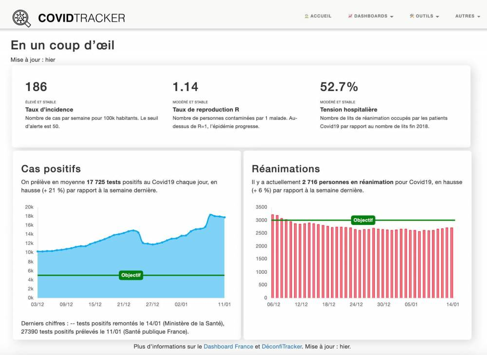
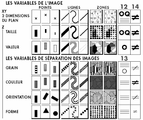
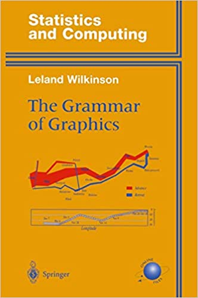
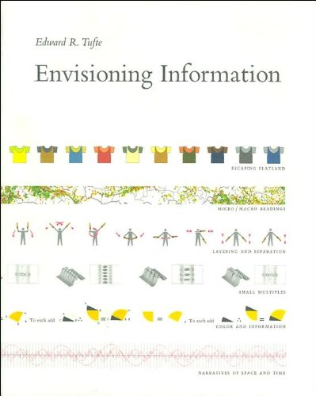
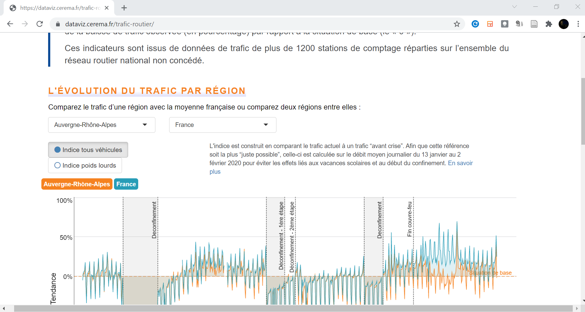
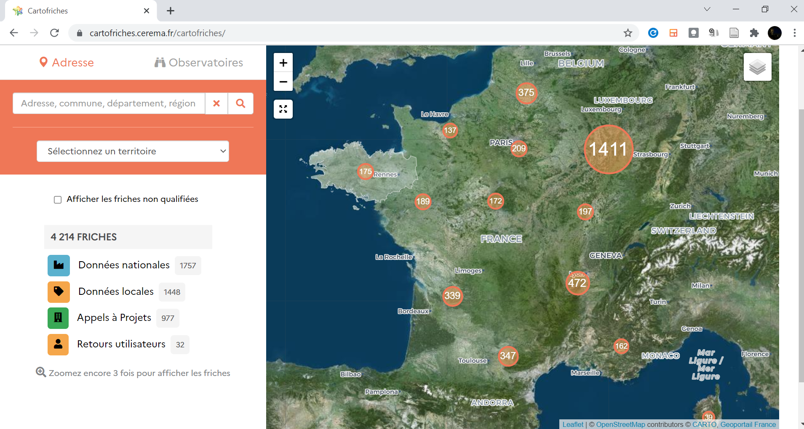

## Quelques exemples de datavisualisation
### La carte du choléra de John Snow

[Voir](https://fr.wikipedia.org/wiki/%C3%89pid%C3%A9mie_de_chol%C3%A9ra_de_Broad_Street)

### Charles Joseph Minard

[Voir](https://fr.wikipedia.org/wiki/Charles_Joseph_Minard)

### La correspondance de Stefanie Posavec et Giorgia Lupi

<!-- addiction téléphone, mauvaise humeur, sorry --> 

[Dar data](http://www.dear-data.com/theproject)

### Le suivi de l'épidémie en ligne de Guillaume Rozier

[Covid-tracker](https://covidtracker.fr/)

### Le Data-Driven DJ de Brian Foo
<iframe title="vimeo-player" src="https://player.vimeo.com/video/118358642?h=8a59e78eff" width="640" height="360" frameborder="0" allowfullscreen></iframe>

[Voir](https://datadrivendj.com/tracks/subway)

## Quelques théories et théoriciens
### Jacques Bertin

### Leland Wilkinson

### Edward Tufte

## Des outils pour visualiser
### Outils bureau
- Tableau 
- ESRI Dashboards
- MViewer
- ...

### Python
- dash
- plotly
- matplotlib
- seaborn
- bokeh
- ...

### R
- Shiny
- ggplot
- Rgl
- ...

### Javascript
- leaflet
- D3 & ObservableHQ
- svelte
- kepler
- Charts.js
- ...

## Des dataviz Cerema faites sous Shiny
### trafic covid

[https://dataviz.cerema.fr/trafic-routier](https://dataviz.cerema.fr/trafic-routier)

### Cartofriches

[https://cartofriches.cerema.fr/](https://cartofriches.cerema.fr/)