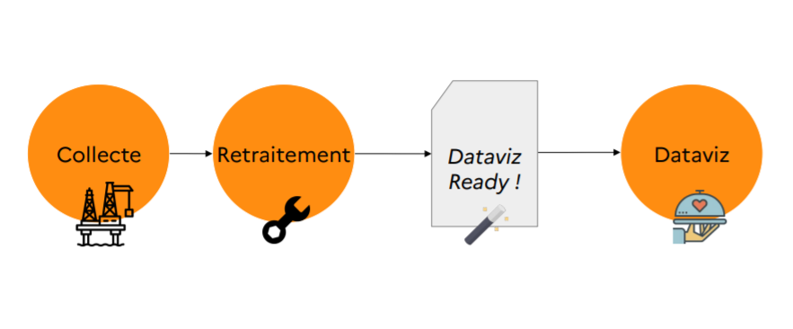

Dans ce notebook, nous allons préparer les données

## Lecture des données
Lisons les données de flux
```{r message = FALSE, warning = FALSE}
library(tidyverse)

flux <- read_csv("../data/obs_artif_conso_com_2009_2020_V2.csv")
```

## Sélection des colonnes
Nous nous intéressons aux flux entre années et allons sélectionner seulement les colonnes utiles, à savoir, les colonnes `art09mix10`, `art10mix11`, etc...
```{r}
myCols <-  names(flux)[grep("^art[0-9]{2}\\S+[0-9]{2}$", names(flux))]
myCols
```

## Transformation du format wide vers long
Nous utiliserons **ggplot2** pour représenter les données. Celui-ci accepte des données au format long et non wide.

Voici la différence entre un fichier de type wide et un fichier de type long :

### Wide

| id | nom | sport | ville | 
| -- | -- | -- | -- |
| 1 | mathieu | squash | Aix-en-Provence |

### Long

| id | variable | valeur |
| -- | -- | -- |
| 1 | nom | mathieu |
| 1 | sport | squash |
| 1 | ville | Aix-en-Provence |

### Transformation au format long avec `gather`
Prenons l'exemple d'Aix en Provence. Les données sont dans un format wide (le plus commun, avec les variables en colonnes) :
```{r}
df <- flux %>% filter(idcom == "13001")
df[, c("idcom", "idcomtxt", myCols)]

```

Pour transformer au format long, nous utilisons la fonction `gather` :
```{r}
df <- df[, c("idcom", "idcomtxt", myCols)]
df <- gather(df,
             "variable", # key
             "value",    # value
             myCols) # variables
df
```

La colonne `variable` comporte des valeurs telles que `art09hab10` pour le flux d'artificialisation vers l'habitat de 2009 à 2010 :
```{r}
unique(df$variable)
```

## Année et destination du flux
Nous allons extraire l'année et le type (habitat, activité, mixte, inconnu) depuis le champ ` variable` :
```{r}
df$year <- gsub("art([0-9]{2})(\\S+)[0-9]{2}", "20\\1", df$variable)
df$type <- gsub("art([0-9]{2})(\\S+)[0-9]{2}", "\\2", df$variable)
```

Voici le résultat:
```{r}
df %>% head
```

## Retraitement
Améliorons le champ `type` pour avoir des libellés plus parlants :
```{r}
df <- df %>% mutate(type = case_when(
  type == "hab" ~ "Habitat",
  type == "act" ~ "Activité",
  type == "mix" ~ "Mixte",
  type == "inc" ~ "Inconnu",
))
```

Au final, nous n'avons plus besoin de la variable variable :
```{r}
df$variable <- NULL
```

Voici notre fichier df au final :
```{r}
df
```

## Fonction `getStatsFlux`
Créons une fonction qui retourne les flux pour une commune donnée à partir de son code INSEE :
```{r}
getStatsFlux <- function(flux, codeInsee) {
  
  # Filtre par commune
  df <- flux %>% filter(idcom == codeInsee) 
  
  # Colonnes intéressantes
  myCols <-  names(flux)[grep("^art[0-9]{2}\\S+[0-9]{2}$", names(flux))]
  df <- df[, c("idcom", "idcomtxt", myCols)]
  
  # Long format
  df <- df %>% gather("variable", # key
                      "value",    # value
                      myCols) # variables
  
  # Année et type
  df$year <- gsub("art([0-9]{2})(\\S+)[0-9]{2}", "20\\1", df$variable)
  df$type <- gsub("art([0-9]{2})(\\S+)[0-9]{2}", "\\2", df$variable)
  
  # Renomme les valeurs de type
  df <- df %>% mutate(type = case_when(
  type == "hab" ~ "Habitat",
  type == "act" ~ "Activité",
  type == "mix" ~ "Mixte",
  type == "inc" ~ "Inconnu"))
  
  # Réagence les colonnes
  df <- df[, c("idcom", "idcomtxt", "year", "type", "value")]
  
  return(df)
}

flux %>% getStatsFlux("13001")
```

Enregistrons cette fonction dans le fichier `helpers.R`

## Data Engineering
Pas mal d'étapes de préparation sont parfois nécessaires avant de créer des applications de dataviz.



Voici la chaîne de données, assez conséquente, pour Cartofriches :

