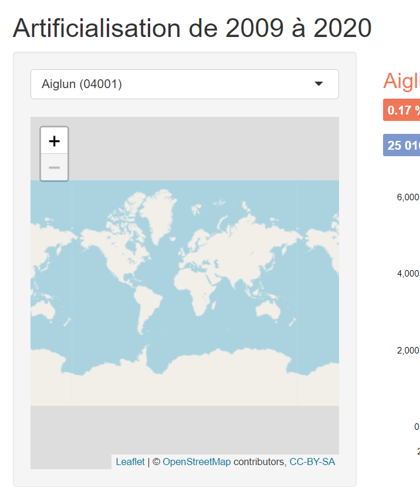
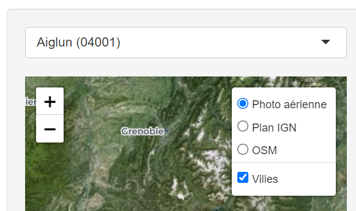
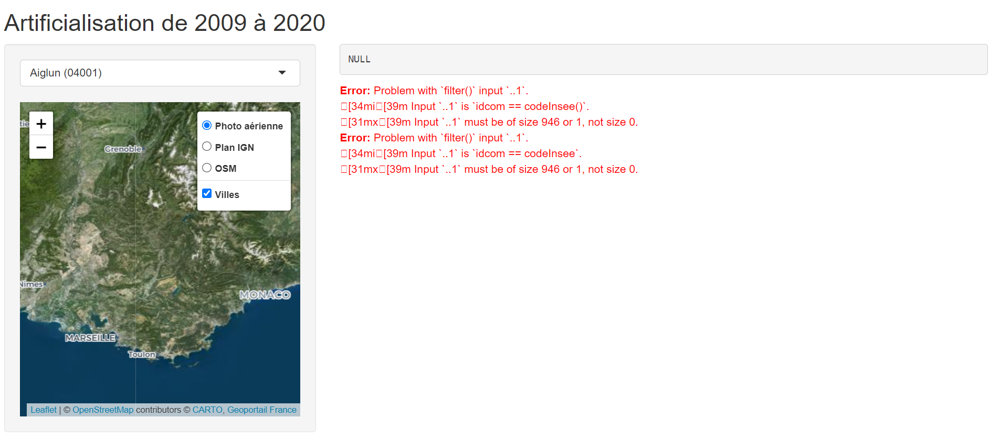
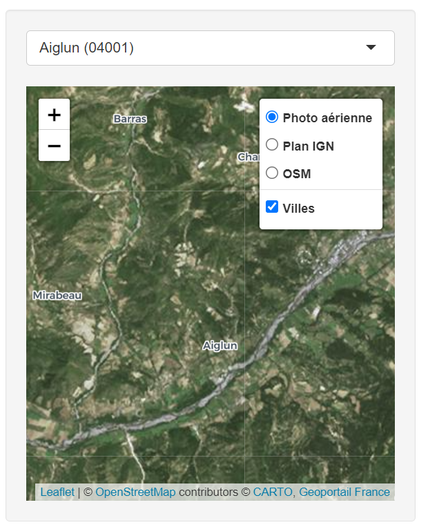

Cette animation montre l'évolution de l'application depuis le premier commit jusqu'au dernier.

Nous partons d'une représentation assez basique (poser les bases) vers l'ajout progressif d'éléments d'interaction utilisateur, de représentation de la données, ainsi que d'éléments contextuels textes.

Cette animation montre l'évolution de l'appli depuis le premier commit jusqu'au dernier :


Le code de l'application est accessible dans le répertoire github [shiny-artif-app](https://github.com/datagistips/shiny-artif-app/blob/master/README.md).

## Préambule
### Template de base
Pour créer une application Shiny, il faut, depuis [RStudio](https://www.rstudio.com/products/rstudio/download/), aller dans `File > New File > Shiny Web App...`


Cela crée une application basique qui sert d'exemple, avec une liste déroulante et un graphique d'exemple :


```{r eval = FALSE }
library(shiny)

ui <- fluidPage(

    # Application title
    titlePanel("Old Faithful Geyser Data"), # on changera le nom de l'appli plus tard

    sidebarLayout(
        sidebarPanel(
            "liste"
        ),
        mainPanel(
          "résultats"
        )
    )
)

server <- function(input, output) {
  # vide pour le moment
}

# Run the application 
shinyApp(ui = ui, server = server)
```
- `ui` est la partie destinée à accueillir les éléments d'interface (esthétique)
- `server` est la partie dans laquelle seront définis les mécanismes d'interaction, d'interrogation et de représentation des données.

> En quelque sorte, par analogie avec un modèle MVC (Modèle Vue Contrôleur), ui concerne la Vue et server le Contrôleur.

► [Voir cette version](https://github.com/datagistips/shiny-artif-app/commit/006bc70d801a290ef1771b69cd2ded14e0b12516) (006bc70d801a290ef1771b69cd2ded14e0b12516)

### Pose les bases 

Dans un premier temps, on pose les bases, et on efface certains éléments de l'application d'exemple.

► [Voir cette version](https://github.com/datagistips/shiny-artif-app/commit/414c6942ce44edd411e256ab0295bb50de2fa059) (414c6942ce44edd411e256ab0295bb50de2fa059)

#### `server.R`
La partie est laissée vide pour le moment :
```{r eval = FALSE}
server <- function(input, output) {
# vide
}
```

### Lecture des données et liste déroulante des communes


On lit les données de flux :
```{r eval = FALSE}
flux <- read_csv("data/obs_artif_conso_com_2009_2020_V2.csv", na = c("", "NULL")) %>% 
    filter(idreg == "93")
```

Ainsi que les données communales :
```{r eval = FALSE}
# Contours de communes
comms <<- readRDS("data/comms.rds") %>% 
    filter(INSEE_REG == 93)

# Liste communes
communes <- flux$idcom
names(communes) <- glue("{flux$idcomtxt} ({flux$idcom})")
```
#### `ui.R`
On ajoute la liste déroulante des communes maintenant qu'elles ont été lues :
```{r eval = FALSE}
    sidebarLayout(
        sidebarPanel(
            selectInput("communes", label = NULL, choices = communes, selected = NULL),
        ),

        mainPanel(
           "Résultats"
        )
    )

```
► [Voir cette version](https://github.com/datagistips/shiny-artif-app/commit/9c271b706e34afff002b6e6d5df7ef895af1907e) (9c271b706e34afff002b6e6d5df7ef895af1907e)

###  Affiche un tableau des résultats


On peut afficher un tableau des résultats de flux pour une commune sélectionnée, juste pour tester les mécanismes de sélection, notamment la fonction `getStatsFlux` vue dans un précédent notebook.

#### `ui.R`
```{r eval = FALSE}
mainPanel(
          dataTableOutput("tbResults")
        )
```

#### `server.R`
On ajoute les résultats avec `renderDataTable` et `dataTableOutput` :
```{r eval = FALSE}
    output$tbResults <- renderDataTable({
        codeInsee <- input$communes
        df <- flux %>% getStatsFlux(codeInsee)
        return(df)
    })
```
► [Voir cette version](https://github.com/datagistips/shiny-artif-app/commit/64c7a25268157cf832c9b57dc71b7dfffd663d9e) (64c7a25268157cf832c9b57dc71b7dfffd663d9e)

## Dataviz (#1)
### Ajoute le stream


On ajoute le streamgraph.

#### `ui.R`
```{r eval = FALSE}
mainPanel(
            streamgraphOutput("streamPlot")
        )
```

#### `server.R`
```{r eval = FALSE}
    output$streamPlot <- renderStreamgraph({
        myStream <- flux %>% makeStream(codeInsee)
        return(myStream)
    })
```
► [Voir cette version](https://github.com/datagistips/shiny-artif-app/commit/a402e8385afcf0c350ac0841037a69383e85eace) (a402e8385afcf0c350ac0841037a69383e85eace)

## Contexte (#1)
### Ajoute les infos communales


On peut ajouter des informations assez sommaires sur la commune sélectionnée, sous la forme de texte.

#### `ui.R`
```{r eval = FALSE}
mainPanel(
    textOutput("txtCommune"),
    streamgraphOutput("streamPlot")
)
```

#### `server.R`
```{r eval = FALSE}
output$txtCommune <- renderText({
    codeInsee <- input$communes
    fComm <- flux %>% filter(idcom == codeInsee)

    paste(fComm$idcomtxt, fComm$idcom, fComm$artcom0920)
})
```
► [Voir cette version](https://github.com/datagistips/shiny-artif-app/commit/602a3ea312be829aca7146e5563c001cdd33e823) (602a3ea312be829aca7146e5563c001cdd33e823)

### Ajoute la légende


#### `server.R`
Pour la légende, on utilise simplement de l'HTML stylisé, plutôt que la légende du plot.

```{r eval = FALSE}
tagList(
            div(
                myStream,
                style="margin-bottom:20px;"
            ),
            div(
                tags$span("Habitat",
                          style = glue("background-color:{myPalette['blue']};padding:10px;")),
                tags$span("Activité",
                          style = glue("background-color:{myPalette['red']};padding:10px;")),
                tags$span("Mixte",
                          style = glue("background-color:{myPalette['magenta']};padding:10px;")),
                tags$span("Inconnu",
                          style = glue("background-color:{myPalette['grey']};padding:10px;")),
                style="text-align:center"
            )
        )
```
On peut faire du HTML assez avancé avec R Shiny !

► [Voir cette version](https://github.com/datagistips/shiny-artif-app/commit/9c2ab647d7d7376fa84ee19b3239822260933d77) (9c2ab647d7d7376fa84ee19b3239822260933d77)

## Charte
### Titre avec couleurs cerema


Ici, on intègre un élément de charte graphique Cerema, notamment la palette graphique de l'établissement au format JSON.

► [Voir cette version](https://github.com/datagistips/shiny-artif-app/commit/c1868418f645a374a8bfda9a3fb11bc0d72a18ec) (c1868418f645a374a8bfda9a3fb11bc0d72a18ec)

## Contexte (#2)
###  Ajoute la surface artificialisée totale
On ajoute une nouvelle information en texte.

► [Voir cette version](https://github.com/datagistips/shiny-artif-app/commit/9c6f9bed953ea15b948fa371a1d988df5acd27ee) (9c6f9bed953ea15b948fa371a1d988df5acd27ee)

## `reactive` (#1)
###  Ajout de reactive `fComm`
Les variables de type `reactive` sont très utiles lorsqu'il s'agit de récupérer à plusieurs endroits le résultat d'une variable calculée car cela évite, entre autres, de devoir répliquer les mécanismes de création de cette variable à ces multiples endroits. Aussi, un mécanisme interne permet de ne pas recalculer la variable si elle n'a pas changé avec les nouveaux critères de création.

#### `server.R`
```{r eval = FALSE}
fComm <- reactive({
    fComm <- flux %>% filter(idcom == input$communes)
    return(fComm)
})
```

On peut récupérer les variables comme ceci :
```{r eval = FALSE}
fComm()$artcom0920
fComm()$nafart0920
```

► [Voir cette version](https://github.com/datagistips/shiny-artif-app/commit/739307b7430ab0d52f3c241fd16d4404c80c927b) (739307b7430ab0d52f3c241fd16d4404c80c927b)

## Carto
###  Ajoute la carte leaflet


#### `ui.R`
```{r eval = FALSE}
leafletOutput("mymap")
```

#### `server.R`
```{r eval = FALSE}
output$mymap <- renderLeaflet({
        leaflet() %>%
            addTiles(group = "OSM")
})
```
► [Voir cette version](https://github.com/datagistips/shiny-artif-app/commit/5e5be7cf03e9ad4d145c292477d958af00f76904) (5e5be7cf03e9ad4d145c292477d958af00f76904)

###  Centre la carte sur PACA


#### `server.R`
Pour ajuster la carte sur PACA, on utile la fonction `fitBounds`.

```{r eval = FALSE}
output$mymap <- renderLeaflet({

        bb <- st_bbox(comms) %>% as.numeric

        leaflet() %>%
            addTiles(group = "OSM") %>%
            fitBounds(lng1 = bb[1], 
                      lat1 = bb[2], 
                      lng2 = bb[3], 
                      lat2 = bb[4])
    })
```
► [Voir cette version](https://github.com/datagistips/shiny-artif-app/commit/593b2972d14ee8f0f044fb43b2abc41932c4b1ab) (593b2972d14ee8f0f044fb43b2abc41932c4b1ab)

### Ajoute les fonds de carte


Ajoutons davantage de fonds cartos, notamment ceux de l'IGN : orthophoto, Plan IGN.

#### `server.R`
```{r eval = FALSE}
output$mymap <- renderLeaflet({

    leaflet() %>%
            addTiles(group = "OSM") %>%
            addProviderTiles(providers$CartoDB.PositronOnlyLabels, group = "Villes") %>% 
            addTiles("http://wxs.ign.fr/choisirgeoportail/wmts?REQUEST=GetTile&SERVICE=WMTS&VERSION=1.0.0&STYLE=normal&TILEMATRIXSET=PM&FORMAT=image/png&LAYER=GEOGRAPHICALGRIDSYSTEMS.PLANIGNV2&TILEMATRIX={z}&TILEROW={y}&TILECOL={x}",
                     options = c(WMSTileOptions(tileSize = 256),
                                 providerTileOptions(minZoom = 1, maxZoom = 15)),
                     attribution='<a target="_blank" href="https://www.geoportail.gouv.fr/">Geoportail France</a>',
                     group = "Plan IGN"
            ) %>%
            addTiles("http://wxs.ign.fr/choisirgeoportail/wmts?REQUEST=GetTile&SERVICE=WMTS&VERSION=1.0.0&STYLE=normal&TILEMATRIXSET=PM&FORMAT=image/jpeg&LAYER=ORTHOIMAGERY.ORTHOPHOTOS&TILEMATRIX={z}&TILEROW={y}&TILECOL={x}",
                     options = c(WMSTileOptions(tileSize = 256),
                                 providerTileOptions(minZoom = 1, maxZoom = 22)),
                     attribution='<a target="_blank" href="https://www.geoportail.gouv.fr/">Geoportail France</a>',
                     group = "Photo aérienne"
            ) %>%
            addLayersControl(baseGroups    = c("Photo aérienne", "Plan IGN", "OSM"),
                             overlayGroups = "Villes",
                             options       = layersControlOptions(collapsed = FALSE)) %>%
            fitBounds(lng1 = bb[1], lat1 = bb[2], lng2 = bb[3], lat2 = bb[4])
})
```
► [Voir cette version](https://github.com/datagistips/shiny-artif-app/commit/fb67dcc4b87bc13a8cb81847be5c4d5aee1e2b95) (fb67dcc4b87bc13a8cb81847be5c4d5aee1e2b95)

###  Coordonnées au clic


Pour trouver les coordonnées au clic, on utile un mécanisme de sélection basé sur input, notamment input$mymap.

> A noter que l'on peut aussi réagir au clic sur une entité (`input$mymap_shape_click`), voire au passage (`input$mymap_shape_mouseover`). [Voir à ce titre la page dédiée sur R Leaflet](https://rstudio.github.io/leaflet/shiny.html#inputsevents).

#### `ui.R`
```{r eval = FALSE}
verbatimTextOutput("foo")
```

#### `server.R`
```{r eval = FALSE}
output$foo <- renderPrint({
    input$mymap_click
})
```
► [Voir cette version](https://github.com/datagistips/shiny-artif-app/commit/a9fd41bd65be309d9a5c9e37835bad164ee9b37c) (a9fd41bd65be309d9a5c9e37835bad164ee9b37c)

## `reactive` (#1)
###  Rend codeInsee reactive
Le code INSEE est récupéré dynamiquement après un clic sur la carte.

On rend le code INSEE reactive car il sera utilisé à plusieurs endroits : [ici](https://github.com/datagistips/shiny-artif-app/commit/1edc95aebfe35df74ca77370b78dc1d0402157a6#diff-ee89f65a0b4e0dccabce1672d6d689b4e2b6ca51ea1e746bdda1eca94aaa6e0fR252) ou encore [là](https://github.com/datagistips/shiny-artif-app/commit/1edc95aebfe35df74ca77370b78dc1d0402157a6#diff-ee89f65a0b4e0dccabce1672d6d689b4e2b6ca51ea1e746bdda1eca94aaa6e0fR276)

► [Voir cette version](https://github.com/datagistips/shiny-artif-app/commit/4ac477bd273eaf5db7b0511764c9555182ef423e) (4ac477bd273eaf5db7b0511764c9555182ef423e)

### Ajoute le reactive
On peut créer des reactive en cascade, comme ici, pour `fComm()` qui s'appuie sur `codeInsee()`

#### `server.R`
```{r eval = FALSE}
fComm <- reactive({
        fComm <- flux %>% filter(idcom == input$communes)
        fComm <- flux %>% filter(idcom == codeInsee())
        return(fComm)
    })
```

Pour le streamgraph, on utilise `codeInsee()` comme ceci :
```{r eval = FALSE}
myStream <- flux %>% makeStream(codeInsee())
```
► [Voir la ligne de code](https://github.com/datagistips/shiny-artif-app/commit/f3d3ffb842c07aaa67a9e4c48b922e8b4fa858dc#diff-ee89f65a0b4e0dccabce1672d6d689b4e2b6ca51ea1e746bdda1eca94aaa6e0fR174)

► [Voir cette version](https://github.com/datagistips/shiny-artif-app/commit/f3d3ffb842c07aaa67a9e4c48b922e8b4fa858dc) (f3d3ffb842c07aaa67a9e4c48b922e8b4fa858dc)

## Refactoring (#1)
###  Fix : ajoute req
Quand les données ne sont pas encore chargées, on peut avoir un rendu bizarre avec un message d'erreur.



Du coup, on introduit la fonction `req` (pour 'requiert') qui exécute la suite seulement si la condition est réalisée :
```{r eval = FALSE}
fComm <- reactive({
    req(codeInsee()) # < ici

    fComm <- flux %>% filter(idcom == codeInsee())
    return(fComm)
})
```
► [Voir cette version](https://github.com/datagistips/shiny-artif-app/commit/115ac4ea9c236d74fcbfd1cb2d48d3ae6309b063) (115ac4ea9c236d74fcbfd1cb2d48d3ae6309b063)

## Carto (#2)
###  Ajoute un marqueur


On crée un proxy à la carte pour réaliser plus tard des actions sur celle-ci (zoomer, ajouter des éléments cartos) sans avoir à recalculer la carte (appelée mymap) à chaque fois :
```{r eval = FALSE}
proxy <- leafletProxy("mymap")
```

On ajoute le centroïde de la commune cliquée :
```{r eval = FALSE}
observe({
    req(codeInsee())
    myComm <- comms %>% filter(INSEE_COM == codeInsee())

    # Ajout du marqueur
    proxy %>% 
        clearMarkers() %>% 
        addMarkers(data = myComm %>% st_centroid)
})
```
► [Voir cette version](https://github.com/datagistips/shiny-artif-app/commit/5821ff9c63199ec0bae647a5874f2080bb9d3d5a) (5821ff9c63199ec0bae647a5874f2080bb9d3d5a)

###  Ajoute le contour de la commune


On ajoute le contour de la commune (c'est plus sympa) :
```{r eval = FALSE}
proxy %>% 
    clearShapes() %>% 
    addPolygons(data = myComm,
                color = paletteCerema$secondaire$orange, 
                weight = 1, 
                smoothFactor = 0.5,
                opacity = 1, 
                fillOpacity = 0.3,
                fillColor = paletteCerema$secondaire$orange,
                highlightOptions = highlightOptions(color = paletteCerema$secondaire$orange, 
                                                    weight = 2,
                                                    fillOpacity = 0.1,
                                                    bringToFront = TRUE))
```
► [Voir cette version](https://github.com/datagistips/shiny-artif-app/commit/9b4455e5213c849edcdad0a9d2f905f377f2f84a) (9b4455e5213c849edcdad0a9d2f905f377f2f84a)

### Va vers la commune


Le marqueur s'affiche, le contour aussi, mais parfois la commune semble loin, lo i n, l o    i   n

Du coup, petite astuce ergonomique : au clic, on va automatiquement vers la commune cliquée :
```{r eval = FALSE}
bb <- st_bbox(myComm)
proxy %>%
    flyToBounds(lng1 = as.numeric(bb$xmin),
                lat1 = as.numeric(bb$ymin),
                lng2 = as.numeric(bb$xmax),
                lat2 = as.numeric(bb$ymax))
```
► [Voir cette version](https://github.com/datagistips/shiny-artif-app/commit/404f64ab1fbd9fe00dd9da0634faf407007278b5) (404f64ab1fbd9fe00dd9da0634faf407007278b5)

###  La liste déroulante permet d'aller vers une commune


On peut même changer le comportement de la liste déroulante utilisée au début pour afficher les stats ([voir cette ligne](https://github.com/datagistips/shiny-artif-app/commit/64c7a25268157cf832c9b57dc71b7dfffd663d9e#diff-ee89f65a0b4e0dccabce1672d6d689b4e2b6ca51ea1e746bdda1eca94aaa6e0fR73)) pour aller automatiquement vers la commune cliquée :
```{r eval = FALSE}
observeEvent(input$communes, {
    codeInsee <- input$communes
    bb <- comms %>% filter(INSEE_COM == codeInsee) %>% st_bbox %>% as.numeric
    proxy %>% flyToBounds(lng1 = bb[1], lat1 = bb[2], lng2 = bb[3], lat2 = bb[4])
})
```

C'est aussi l'occasion d'introduire `observeEvent` qui 'écoute' les évènements, et qui, ici déclenche une action lorsqu'on choisit un élément dans la liste des communes (`input$communes`)

► [Voir cette version](https://github.com/datagistips/shiny-artif-app/commit/d295c184cd8801dfdcc4befb414d98ea8c0d4ea9) (d295c184cd8801dfdcc4befb414d98ea8c0d4ea9)

###  Ajoute l'élément vide à la liste des communes


Généralement, le premier élément d'une liste est une instruction type 'Veuillez choisir une commune'

► [Voir cette version](https://github.com/datagistips/shiny-artif-app/commit/4e5c6628148bb98841d8468d10dea8a69b2e5c6d) (4e5c6628148bb98841d8468d10dea8a69b2e5c6d)

## Refactoring (#2)
###  Précise qu'il faut cliquer sur la carte pour afficher les stats


Au lieu d'utiliser `req` ([voir ce commit](https://github.com/datagistips/shiny-artif-app/commit/115ac4ea9c236d74fcbfd1cb2d48d3ae6309b063)) qui conditionne l'affichage à la sélection d'une commune, nous pouvons générer un message pour préciser qu'il faut cliquer sur la carte lorsqu'aucune commune n'a été cliquée.

Si aucune commune n'est sélectionnée : valeur nulle, alors on affiche ce message ([Voir la ligne de code](https://github.com/datagistips/shiny-artif-app/commit/56fd55bfa4cc066af658f7c779398c95c8276275?diff=split#diff-ee89f65a0b4e0dccabce1672d6d689b4e2b6ca51ea1e746bdda1eca94aaa6e0fR202-R203))
:
```{r eval = FALSE}
if(is.null(codeInsee())) return(tagList(icon("mouse-pointer"), "Cliquez sur la carte pour afficher les statistiques"))
```

► [Voir cette version](https://github.com/datagistips/shiny-artif-app/commit/56fd55bfa4cc066af658f7c779398c95c8276275) (56fd55bfa4cc066af658f7c779398c95c8276275)

## Dataviz (#2)
### Ajoute la treemap et supprime la légende


Tiens, comme on y est, pourquoi pas ajouter une treemap.

#### `ui.R`
```{r eval = FALSE}
plotlyOutput("treemap")
```

#### `server.R`
```{r eval = FALSE}
output$treemap <- renderPlotly({
    req(codeInsee())
    flux %>% makeTreemap(codeInsee())  
})
```
► [Voir cette version](https://github.com/datagistips/shiny-artif-app/commit/1edc95aebfe35df74ca77370b78dc1d0402157a6) (1edc95aebfe35df74ca77370b78dc1d0402157a6)

## Refactoring (#3)
### Sépare en `ui.R`, `server.R` et `global.R`
Lorsque le code d'une application devient conséquent, cela peut être utile, plutôt que d'utiliser un unique fichier `app.R`, de séparer le contenu dans trois fichiers : `ui.R`, `server.R` et `global.R`

- `ui.R` comprend les éléments d'interface auparavant contenus dans `ui <- fluidPage({...})`
- `server.R` comprend la logique applicative et fonctionnelle de l'application : mécanismes d'interrogation et de représentation des données, auparavant contenue dans `server <- function(input, output) {...}`
- `global.R` comprend les variables utilisées dans l'application.

### Au sujet de `global.R`
Les variables contenues dans `global.R` deviennent automatiquement globales.

Il n'y a alors plus besoin d'utiliser la double flèche d'assignation des variables globales dans `global.R`

#### `server.R`
Précédemment, on avait ceci dans `server.R` :
```r
`monNom <<- "Mathieu"
```

#### `global.R`
Dans `global.R`, la variable devient automatiquement globale même avec une assignation simple :
```r
`monNom <- "Mathieu"`
```

► [Voir cette version](https://github.com/datagistips/shiny-artif-app/commit/81991cf6ba1a4abef9df951bcdcc1858d97b6815) (81991cf6ba1a4abef9df951bcdcc1858d97b6815)

### Ajoute un fichier `helpers.R`
On peut créer un fichier annexe appelé `helpers.R` (nous aurions également pu l'appeler functions.R) dans lequel stocker les différentes stockées utilisées auparavant dans `server.R`

Cela a le mérite de rendre le code du fichier `server.R` plus _léger_, plus _lisible_ car mettant en évidence les mécanismes de façon macro plutôt que micro avec le détail de leur fonctionnement interne.

Nous faisons appel au fichier `helpers.R` au sein de `global.R`

#### `global.R`
```r
source("helpers.R", encoding = "UTF-8")
```

[Voir cette version](https://github.com/datagistips/shiny-artif-app/commit/b6a508c9db407cdc98969b50b80867554978796c) (b6a508c9db407cdc98969b50b80867554978796c)