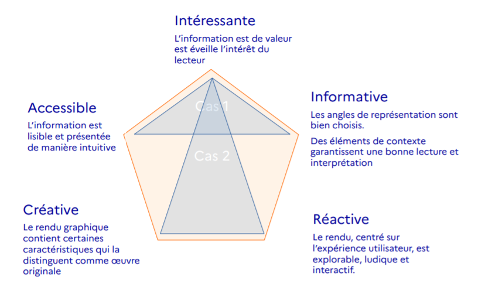

## Data centric

Comme nous venons de le voir, le développement de l'application Shiny se concentre avant sur la donnée, si bien qu'une application Shiny peut tout à fait être développée sans connaissance du HTML, ou du CSS (bien que leur connaissance soit un pré-requis pour l'esthétisation du site).

Le contenu, à savoir la donnée, occupe une place centrale, et le développement du contenant, son habillage peuvent être opérés a posteriori.

Le développement peut être réalisé par un statisticien. Un ergonome peut ensuite définir le UX Design, à savoir le design de l'interface et de ses interactions. Enfin, un graphiste peut venir habiller le site d'une certaine charte graphique.

## Les étapes de développement d'une dataviz
Comme nous l'avons vu dans les notebooks 1 à 7, beaucoup de préparation est nécessaire avant d'aboutir à l'application : préparation des données, voire aussi préparation des mécanismes (fonctions) d'interrogation des données ou de représentation de celles-ci.

Le développement de cette dataviz a suivi ces différentes étapes :

### Collecte
Bien sûr, on ne peut pas représenter des choses qui n'existent pas, d'où l'importance de la collecte, et de la stabilité du point d'accès à la donnée, notamment lorsque votre dataviz doit être mise à jour régulièrement.

### Qualité

Une dataviz faite sur des données posant des soucis de qualité produira des graphiques de mauvaise qualité.

### Sémiologie
Une certaine sémiologie graphique et rigueur doit être suivie afin de restituer de manière convenable l'information à l'utilisateur.

### Expérience utilisateur
L'expérience utilisateur doit être prise en compte lors du développement, que ce soit dans la manipulation de l'interface ou la lecture des graphiques.

### Fonctionnalité
Rendre fonctionnel et généralisable les mécanismes sous la forme de fonctions permet déjà de rendre le code plus parlant, plus léger à la lecture, plus pérenne et appropriable par une tierce personne, mais aussi de les utiliser ailleurs, dans d'autres applis.

### Esthétique
Pas mal de temps peut être passé dans l'esthétique. Le respect d'une charte graphique, l'esthétisation est souvent le premier désir de celui qui vous demandera une application de dataviz.

### Refactoring
Enfin, le refactoring vise à améliorer les commentaires dans le code, réorganiser certaines fonctions, certains blocs de code pour faciliter la lecture et la pérénnité du code informatique, son appropriation par d'autres, ou par vous-même (lorsque le vent vous aura mené entre temps vers de multiples applis et que vous l'aurez un peu oubliée !)

## Dimensions d'une dataviz
Voici selon moi les dimensions d'une dataviz :

Dans les cas 1 et 2, l'information est intéressante, de valeur.

Dans le premier cas (cas 1), oin s'attache davantage à l'accessibilité de la dataviz, le fait qu'elle puisse être lue et interprétée facilement, alors que le second cas est celui d'une dataviz sophistiquée dans sa manière de rendre, et sans doute créative, mais qui ne mise pas vraiment sur l'accessibilité de la représentation.

Le second cas est souvent privilégié par ceux qui s'intéressent aux représentations abstraites et artistiques réalisées avec de la donnée, à savoir celles réalisées par des data artists, comme on serait tentés de les appeler.

La première stratégie est sans doute celle à adopter par d'institutions publiques, car privilégiant la transmission et l'intelligibilité des informations à diffuser.